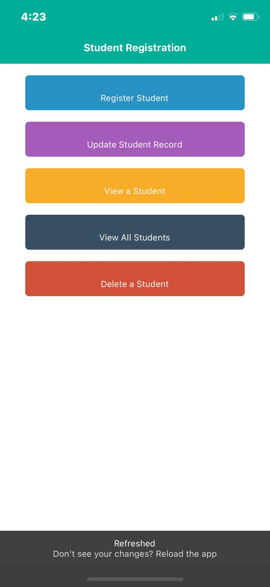
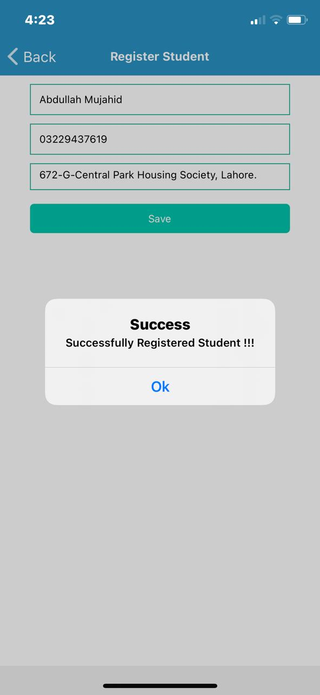
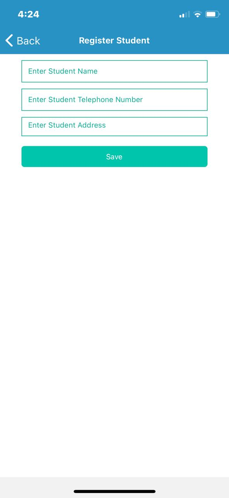
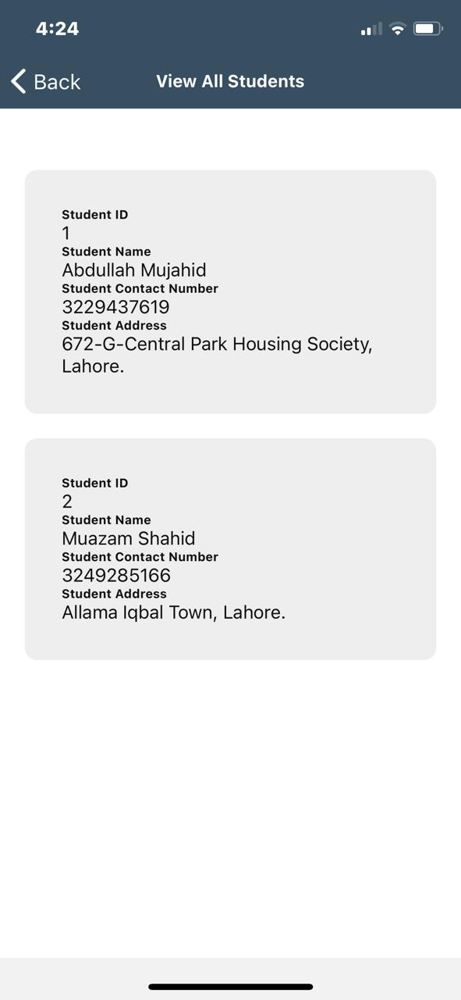
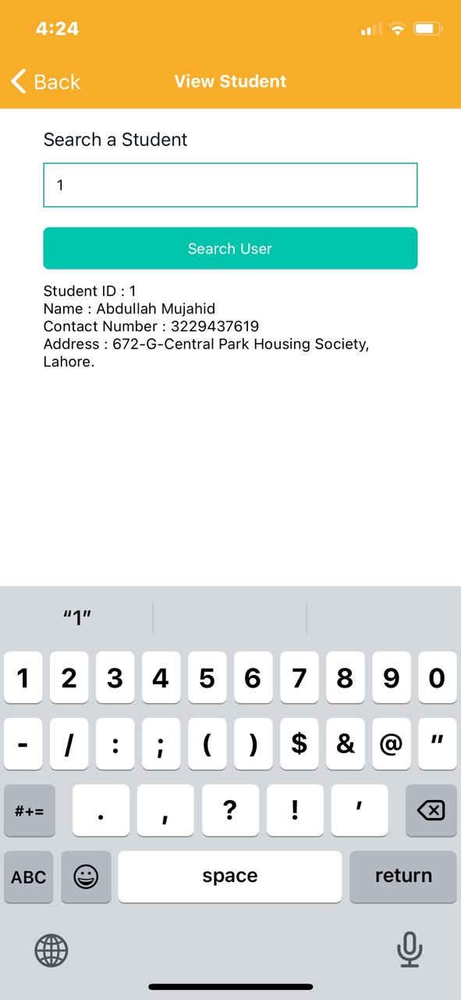
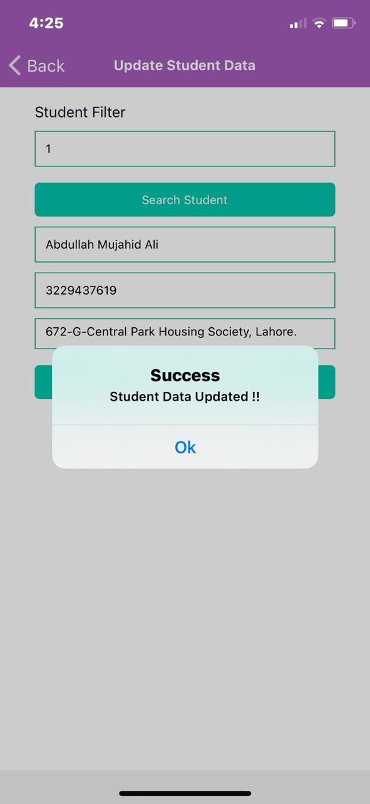
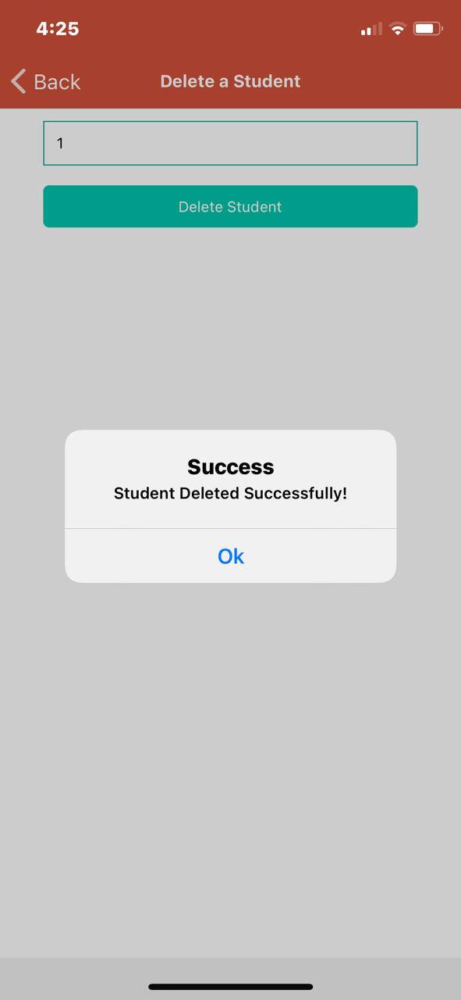

# Student-CRUD--React-Native

[](https://github.com/abdullahmujahidali/Student-CRUD--React-Native-)
[](https://opensource.com/users/abdullahmujahidali)
[](https://www.python.org/)
[](https://github.com/abdullahmujahidali/Student-CRUD--React-Native-)
[](https://github.com/abdullahmujahidali)
[](https://twitter.com/abdulladgaf)

Please consider following this project's author, [Abdullah Mujahid](https://github.com/abdullahmujahidali), and consider starring the project to show your :heart: and support.


# THIS APPLICATION IS OFFICIALLY PUBLISHED ON EXPO FOR BOTH ANDROID AND IOS USER
## LINK: https://expo.io/@abdullahmujahidali/projects/ToDoList

### EXPO PUBLISHED

https://expo.io/@abdullahmujahidali/StudentCRUD


## 🛠️ Build with

* [NodeJS](https://nodejs.org/en/) - Node JS
* [Vs Code](https://code.visualstudio.com/) - IDE
* [React Native](https://reactnative.dev/) - React Native for iOS and Android
* [Expo](https://expo.io/) - Visualizer
* [SQLite](https://www.sqlite.org/index.html) - Database
* [DB Browser for SQLite](https://www.sqlite.org/index.html) - Database IDE


## ABOUT
This Project is of a Student Registration App, with the basic functionalities of a CRUD using the SQLite Database.
When running the project, it checks if the database exists, if it does not exist, it creates the database and the table structure to start using it.


</br>

## 🖼️ Project Images

</br>

<div align="center">
  
  
  
  
  
  
  
</div>

</br>


## Steps to run this application
* Clone:
```bash
        ∧∧
　　 ( ´◔ω◔`)　＜・・・・・・ $ git clone https://github.com/abdullahmujahidali/Student-CRUD--React-Native-
　 ＿|　⊃／(＿＿
／　└-(＿＿＿_／
￣￣￣￣￣￣￣

　＜⌒／ヽ-､＿＿ 　 　　*thanks
／＜_/＿＿＿＿／

```


### Author

**Abdullah Mujahid**

* [LinkedIn Profile](https://https://www.linkedin.com/in/abdullah-mujahid-211849186/)
* [GitHub Profile](https://github.com/abdullahmujahidali)
* [Twitter Profile](https://twitter.com/abdulladgaf)

### License
Copyright © 2021, [Abdullah Mujahid](https://github.com/abdullahmujahidali).
Released under the [MIT License](LICENSE).

